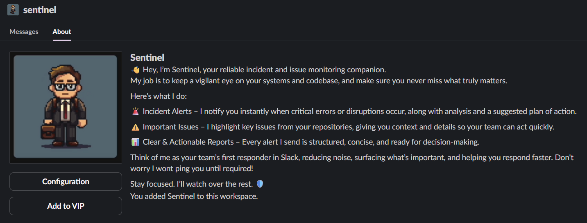
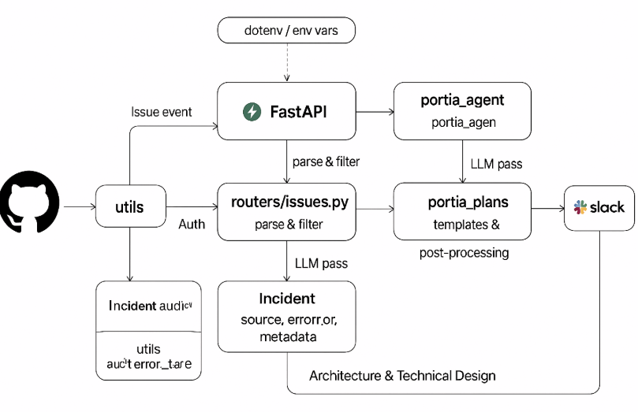
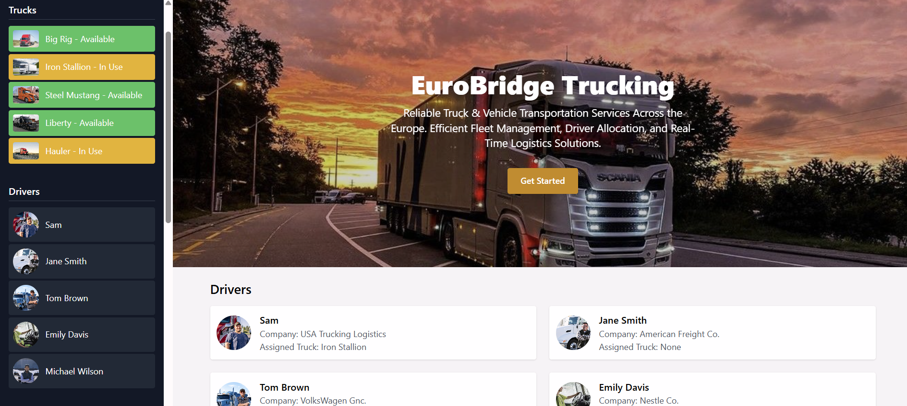

## Sentinel - powered by Portia AI

Sentinel is an intelligent, automated incident analysis agent that integrates seamlessly with engineering workflows to accelerate root-cause discovery, issue triage, and contributor onboarding. Built for real-world DevOps environments, Sentinel combines log/error analysis, AI-powered severity assessment, and actionable reporting — all without manual intervention.




## Overview

Sentinel is designed to streamline incident handling by automatically analyzing and classifying system issues as they occur. By leveraging state-of-the-art generative AI (Google Gemini), Sentinel presents teams about root causes, and intelligent suggestions about contributor suitability—all delivered in developer-friendly language via real-time integrations.


## Impact & Innovation

Sentinel offers:
- **Faster onboarding**: New contributors quickly identify issues they can solve in slack only.

- **Consistent triage**: Automated, bias-free contributor suggestions.
- **Seamless DevOps**: Plug-and-play integrations for both legacy and modern systems

Developed with a focus on real-world usability, Sentinel moves incident response from reactive firefighting to proactive, team-wide intelligence. This not only improves uptime but drives growth, learning, and meaningful contribution for developers of all experience levels.


## Features

**Automated Log & Error Analysis**  
Sentinel ingests incident reports (source, error details, full metadata), inspects the evidence, and produces structured human-readable summaries. This eliminates manual log sifting and accelerates decision-making.

**AI-Driven Triage & Contributor Routing**  
Using Google Gemini’s large language model, Sentinel evaluates the complexity of incidents:
- Simple, well-scoped issues are flagged as suitable for new contributors.
- Help wanted, multi-layered incidents are designated for experienced maintainers.


**Real-Time Slack Notifications**  
Sentinel automatically posts AI-generated analyses and next-step recommendations to Slack channels, ensuring rapid team awareness and response.

**Easy Extensibility**  
Modular by design, Sentinel can connect to any CI/CD pipeline or error reporting mechanism with minimal configuration.


## Architecture & Technical Design

Sentinel is built as a lightweight Python microservice with FastAPI endpoints, exposing REST interfaces for incident ingestion. Each incident runs through the following pipeline:

1. **Ingestion**  
   Incident with `source`, `error_message`, and full JSON metadata is POSTed to Sentinel.

2. **Analysis**  
   - Basic validation & parsing with Pydantic
   - Application of Gemini AI:
     - Summarize incident context
     - Assess severity and clarity
     - Suggest likely root causes
     - Tag as “good first issue” or “Help wanted” but can be customized as per needs.

3. **Reporting**  
   - Format as structured report (title, summary, recommendations)
   - Immediate notification through Slack and, if desired, other tools

      

   *(ai generated)


## Integration: EuroBridge Trucking, A Truck CRM App

Sentinel powers the backend of the *EuroBridge Trucking - Truck CRM* app, a demo frontend that simulates typical maintenance, data, or bug tracking scenarios faced by any organization.  
Incidents generated within this app flow automatically to Sentinel for real-time AI triage and reporting.




## How it Works

1. **Detect**: Issue arises in CRM app or CI/CD pipeline.
2. **Analyze**: Incident POSTed to `/incident` endpoint.
3. **Classify**: Gemini evaluates issue type and complexity.
4. **Report**: Slack receives structured summary, root cause guess, and contributor suggestion.


## Tech Stack

- **Python 3**: High-performance backend logic
- **FastAPI**: For REST API endpoints
- **Pydantic**: Robust data modeling and validation
- **Google Gemini AI**: Large language model for decision logic and summaries
- **Slack SDK**: Event-based notifications
- **EuroBridge Trucking App**: React-based demo frontend


## Setup & Usage

**Requirements**  
- Python 3.9+
- A valid Google Gemini API key (for AI-powered features)
- Portia API key 
- Github Webhook URL & Token
- Slack Bot token and Channel ID

**Quickstart**
```
git clone https://github.com/your-username/sentinel-incident-bot.git

cd sentinel-incident-bot

pip install -r requirements.txt

cp .env.example .env # fill with your keys

uvicorn main:app --reload
```

Trigger test incidents from the EuroBridge Trucking CRM app or send sample payloads to `/incident` to see Sentinel in action.

**Configuration**  
All environmental variables (API keys, Slack tokens) are managed via `.env` for security and portability.

---
